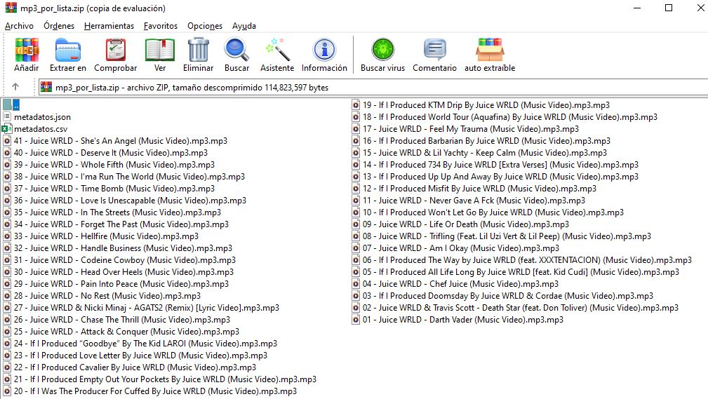
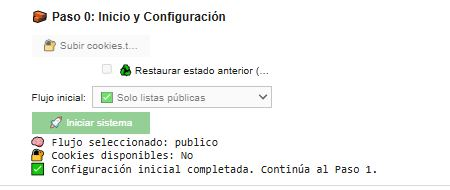
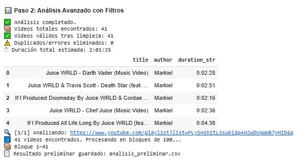
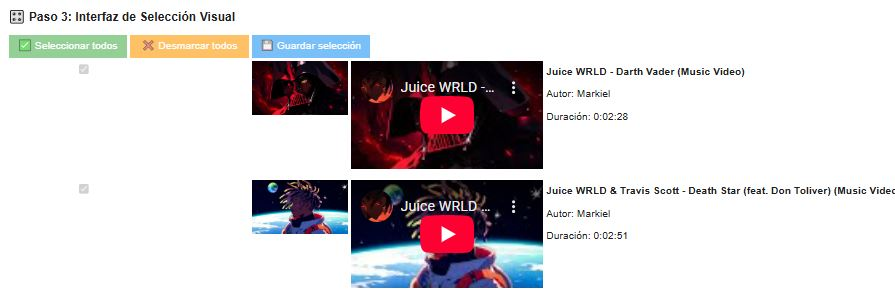
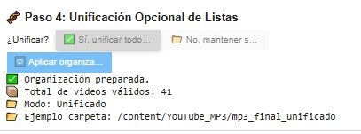
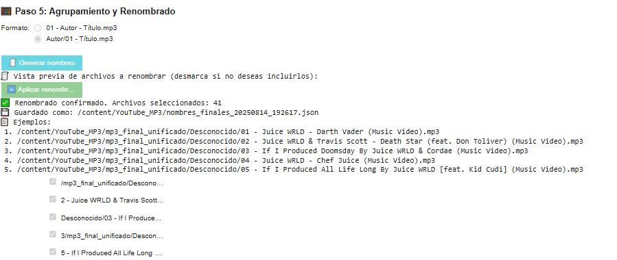
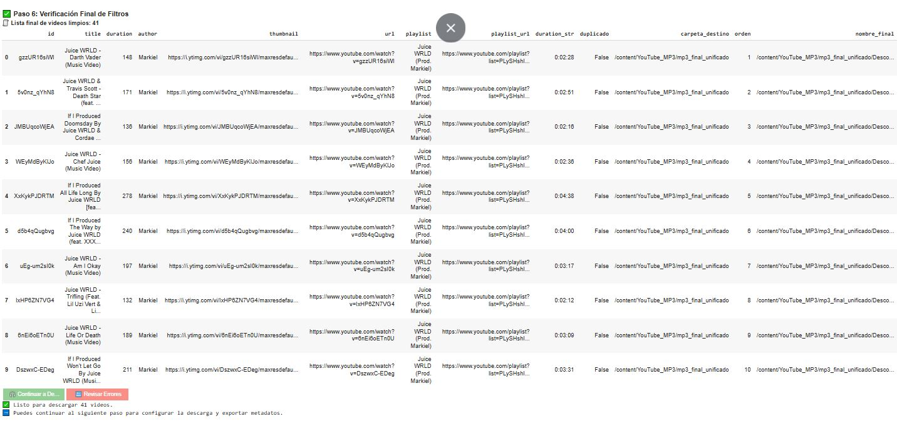
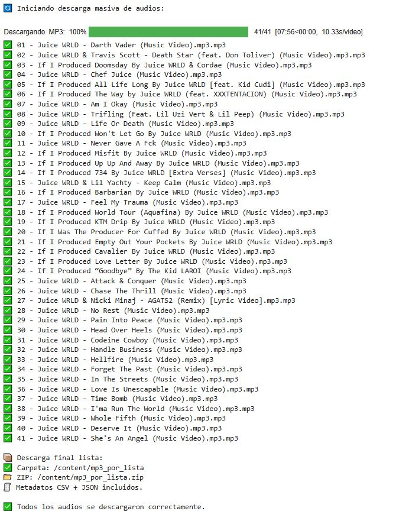
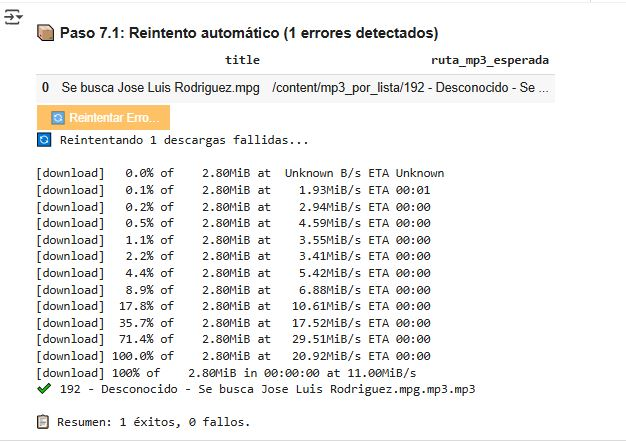
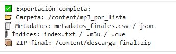

# 🎶 Playlist Harvester AI — Gestión Integral - Analisis y Descarga Masiva de Playlists

**Tipo de archivo:** Python · Jupyter · Portable

📩 **Contacto:** [gabrielce992@gmail.com](mailto:gabrielce992@gmail.com)

---

## 📑 Descripción

**Playlist Harvester AI** es una solución integral para la **gestión, análisis y descarga masiva de playlists de YouTube a MP3**, diseñada para ejecutarse directamente en **Google Colab** sin instalaciones locales.

Permite:

* Procesar listas **públicas y privadas** (con cookies).
* Analizar cientos de videos en **bloques seguros**.
* Seleccionar canciones de forma **visual e interactiva**.
* **Renombrar, organizar y exportar** en múltiples formatos.
* Generar un `.zip` con MP3 organizados + metadatos `.csv/.json` + índices `.m3u/.cue`.

⚠️ **Aviso legal / privacidad:**
Usa esta herramienta solo con contenidos de los que tengas derecho.
Las cookies son proporcionadas por el usuario; la herramienta **no extrae ni envía credenciales**.

---
## 🔗 Capturas Demostrativas

Capturas mostrando las principales etapas del sistema:

### Vista Final del Archivo 

### Paso 0 — Configuración

### Paso 1 — Ingreso de playlists

### Paso 2 — Análisis de contenido

### Paso 3 — Selección visual

### Paso 4 — Organización de carpetas

### Paso 5 — Renombrado

### Paso 6 — Verificación final

### Paso 7 — Descarga

### Paso 7.1 — Reintentos de errores

### Paso 8 — Exportación extendida

---
## 🚀 Guía de Usuario — Playlist Harvester AI v2.0

Bienvenido 🎧. Esta herramienta transforma **playlists completas de YouTube** en **colecciones organizadas de MP3**, listas para usar en tu biblioteca musical.

### 🧱 Paso 0 — Configuración Inicial

* 🔐 **Subir Cookies:** para playlists privadas o *Ver más tarde*.
* ♻️ **Restaurar Proyecto:** carga un `proyecto.json` previo.
* 🎛️ **Seleccionar Flujo:** listas públicas, privadas o mixtas.
* 🚀 **Iniciar sistema** para preparar el entorno.

### 📥 Paso 1 — Ingresar las Playlists

* Pega las **URLs de playlists** (una por línea).
* 🔎 **Validar y guardar** para clasificarlas como públicas/privadas.

### 📊 Paso 2 — Análisis de Contenido

* Extrae datos en bloques de 100 videos.
* Muestra duración total y tabla con primeros resultados.

### 🎛️ Paso 3 — Selección Visual de Canciones

* Vista interactiva con **miniaturas + reproductor embebido**.
* Marca/desmarca canciones, detecta duplicados ⚠️.
* ✅ Seleccionar todos · ❌ Desmarcar todos · 💾 Guardar selección.

### 🧬 Paso 4 & 5 — Organización y Renombrado

* **Unificar o separar carpetas** por playlist.
* **Formatos de nombres personalizables**:

  * `01 - Autor - Título.mp3`
  * `Autor/01 - Título.mp3`
* 🧾 Previsualizar nombres · 🔤 Aplicar renombrado.

### ✅ Paso 6 & 7 — Verificación y Descarga

* Tabla final de resultados.
* 🎧 **Descarga masiva en MP3** con barra de progreso.
* 📦 Genera un `.zip` con todos los audios organizados.

---

## ⚙️ Funciones Adicionales

* 🔄 **Reintento de Errores (Paso 7.1):** reanuda solo archivos fallidos.
* 📂 **Exportación Extendida (Paso 8):** incluye metadatos `.csv/.json` + índices `.m3u/.cue`.
* 💾 **Gestión de Proyectos (Paso 9):** guardar/cargar progreso para continuar en sesiones futuras.

---

## 📦 Estado del Proyecto

✅ **Disponible y portable en Google Colab**
Se ejecuta 100% en la nube, sin necesidad de instalación local.

---

## 🛠️ Tecnologías

* **Python 3**
* **Google Colab**
* **yt-dlp** — Descarga y extracción de metadatos
* **pandas** — Manipulación de datos
* **ipywidgets** — Interactividad visual

Aquí tienes esa parte adaptada al **Playlist Harvester AI**, manteniendo el mismo estilo que usamos en los demás proyectos:

---

## 📦 Releases

* Formato: `playlistharvester-v2.0.zip`
* Contenido:

  * `notebooks/` (flujo completo en Google Colab)
  * `src/` (funciones principales y auxiliares)
  * `requirements.txt` (dependencias mínimas)
  * `assets/` (capturas demostrativas del flujo de trabajo)
* Distribución opcional protegida con contraseña → contacto por email.

---

## 📬 Contacto

📧 **[gabrielce992@gmail.com](mailto:gabrielce992@gmail.com)**
📱 **WhatsApp:** +51 991 744 486 🇵🇪

---

## 📝 Changelog (v2.0 — inicial)

* Procesamiento de playlists públicas y privadas.
* Análisis en bloques seguros con `yt-dlp`.
* Selección visual de canciones con ipywidgets.
* Organización y renombrado flexible de archivos.
* Descarga masiva a MP3 + exportación extendida (`.csv/.json/.m3u/.cue`).
* Gestión de proyectos para guardar/restaurar sesiones.

---

